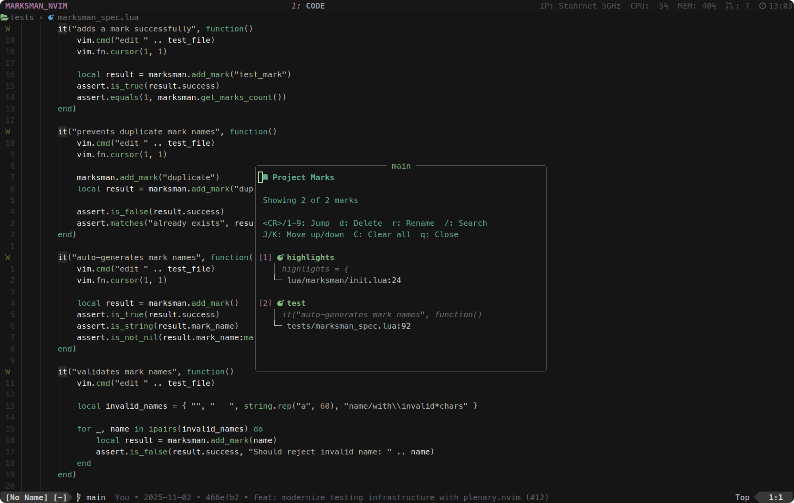

<p align="center">
  
</p>

<p align="center">
  Advanced bookmarks for Neovim that actually stick around.
</p>

<div align="center">
  
  
</div>

## Why?
Vim's built-in marks are great, but they're global and get messy fast. Marksman keeps your bookmarks organized by project, adds powerful search capabilities, and provides a clean interface to manage them.

## Features

- **Project-scoped marks** - Each project gets its own isolated set of bookmarks
- **Persistent storage** - Your marks survive Neovim restarts with automatic backup
- **Smart naming** - Context-aware auto-generation using Treesitter and pattern matching
- **Quick access** - Jump to marks with single keys or interactive UI
- **Sequential navigation** — Jump to the closest mark relative to your cursor, fallback to jump from mark 1 when no marks are in the current file
- **Enhanced search** - Find marks by name, file path, or content with real-time filtering
- **Mark reordering** - Move marks up/down to organize them as needed
- **Multiple integrations** - Works with Telescope, Snacks.nvim, and more
- **Memory efficient** - Lazy loading, cleanup, and debounced operations
- **Robust error handling** - Graceful fallbacks and comprehensive validation

## Requirements

- Neovim >= 0.8.0

## Installation

### lazy.nvim

```lua
{
  "alexekdahl/marksman.nvim",
  opts = {},
}
```

### With configuration

```lua
{
  "alexekdahl/marksman.nvim",
  opts = {
    keymaps = {
      add = "<C-a>",
      show = "<C-e>", 
      goto_1 = "<M-y>",
      goto_2 = "<M-u>",
      goto_3 = "<M-i>",
      goto_4 = "<M-o>",
    },
    max_marks = 100,
    minimal = false,
    silent = false,
    disable_default_keymaps = false,
    debounce_ms = 500,
  },
}
```

### With lazy loading (keys)

```lua
{
  "alexekdahl/marksman.nvim",
  keys = {
    {
      "<C-a>",
      function() require("marksman").add_mark() end,
      desc = "Add mark",
    },
    {
      "<C-e>",
      function() require("marksman").show_marks() end,
      desc = "Show marks",
    },
    {
      "<M-y>",
      function() require("marksman").goto_mark(1) end,
      desc = "Go to mark 1",
    },
    {
      "<M-u>",
      function() require("marksman").goto_mark(2) end,
      desc = "Go to mark 2",
    },
    {
      "<M-i>",
      function() require("marksman").goto_mark(3) end,
      desc = "Go to mark 3",
    },
    {
      "<M-o>",
      function() require("marksman").goto_mark(4) end,
      desc = "Go to mark 4",
    },
  },
  opts = {
    max_marks = 4,
    minimal = true,
    silent = true,
    disable_default_keymaps = true,
  },
}
```

## Setup

```lua
require("marksman").setup({
  keymaps = {
    add = "<C-a>",           -- Add mark
    show = "<C-e>",          -- Show marks window
    goto_1 = "<M-y>",        -- Jump to mark 1
    goto_2 = "<M-u>",        -- Jump to mark 2
    goto_3 = "<M-i>",        -- Jump to mark 3
    goto_4 = "<M-o>",        -- Jump to mark 4
  },
  auto_save = true,          -- Auto-save marks
  max_marks = 100,           -- Max marks per project (1-1000)
  minimal = false,           -- Minimal UI mode
  silent = false,            -- Suppress notifications
  disable_default_keymaps = false,
  debounce_ms = 500,         -- Save debounce (100-5000ms)
  highlights = {
    ProjectMarksTitle = { fg = "#61AFEF", bold = true },
    ProjectMarksNumber = { fg = "#C678DD" },
    ProjectMarksName = { fg = "#98C379", bold = true },
    ProjectMarksFile = { fg = "#56B6C2" },
    ProjectMarksLine = { fg = "#D19A66" },
    ProjectMarksText = { fg = "#5C6370", italic = true },
  },
})
```

## Usage

### Basic Operations

1. **Add a mark**: `<C-a>` at cursor position
2. **Show marks**: `<C-e>` opens floating window
3. **Jump to marks**: `<M-y>`, `<M-u>`, `<M-i>`, `<M-o>` for marks 1-4
4. **In marks window**: 
   - `<CR>` or `1-9` to jump
   - `d` to delete, `r` to rename
   - `/` to search, `J`/`K` to reorder
   - `C` to clear all, `q` to close

### Commands

```
:MarkAdd [name]              - Add mark with optional name
:MarkGoto [name]             - Jump to mark or show list
:MarkDelete [name]           - Delete mark
:MarkRename old new          - Rename mark
:MarkList                    - Show marks window
:MarkClear                   - Clear all marks
:MarkSearch [query]          - Search marks
:MarkExport / :MarkImport    - Export/import marks
:MarkStats                   - Show statistics
```

## Integrations

### Telescope

```lua
local function telescope_marksman()
  local marksman = require("marksman")
  local marks = marksman.get_marks()
  
  if vim.tbl_isempty(marks) then
    vim.notify("No marks in current project")
    return
  end
  
  local pickers = require("telescope.pickers")
  local finders = require("telescope.finders")
  local conf = require("telescope.config").values
  
  local entries = {}
  for name, mark in pairs(marks) do
    table.insert(entries, {
      value = name,
      display = name .. " (" .. vim.fn.fnamemodify(mark.file, ":~:.") .. ":" .. mark.line .. ")",
      ordinal = name .. " " .. mark.file,
      filename = mark.file,
      lnum = mark.line,
      col = mark.col,
    })
  end
  
  pickers.new({}, {
    prompt_title = "Project Marks",
    finder = finders.new_table({ results = entries, entry_maker = function(entry) return entry end }),
    sorter = conf.generic_sorter({}),
    previewer = conf.grep_previewer({}),
  }):find()
end

vim.keymap.set("n", "<leader>fm", telescope_marksman)
```

### Snacks.nvim

```lua
function M.snacks_marksman()
  local marksman = require("marksman")
  local marks = marksman.get_marks()
  
  local results = {}
  for name, mark in pairs(marks) do
    table.insert(results, {
      text = name,
      file = mark.file,
      pos = { tonumber(mark.line) or 1, tonumber(mark.col) or 1 },
      display = string.format("%s %s:%d", name, vim.fn.fnamemodify(mark.file, ":~:."), mark.line),
    })
  end
  
  return results
end
```

## API

### Core Functions

```lua
local marksman = require("marksman")

-- Basic operations return { success, message, ... }
local result = marksman.add_mark("my_mark")
local result = marksman.goto_mark("my_mark")  -- or goto_mark(1) for index
local result = marksman.goto_next()
local result = marksman.goto_previous()
local result = marksman.delete_mark("my_mark")
local result = marksman.rename_mark("old", "new")

-- Utility functions
local marks = marksman.get_marks()
local count = marksman.get_marks_count()
local filtered = marksman.search_marks("query")
local stats = marksman.get_memory_usage()

-- Show UI
marksman.show_marks("optional_search")
```

## How it works

**Storage**: Marks are stored in `~/.local/share/nvim/marksman_[hash].json` per project with automatic backup.

**Smart Naming**: Auto-generates context-aware names:
- `fn:calculate_total` for functions
- `class:UserModel` for classes  
- `var:api_key` for variables
- `filename:line` as fallback

**Project Detection**: Uses Git root, common project files (.git, package.json, etc.), or current directory.

**Search**: Multi-field search across mark names, file paths, and code content.

## Development

### Quick Start
```bash
# Install dependencies and run tests
just install-deps
just test

# Lint and format code
just lint
just format

# Watch tests during development
just test-watch
```

See [CONTRIBUTING.md](CONTRIBUTING.md) for detailed guidelines.

## License

MIT
